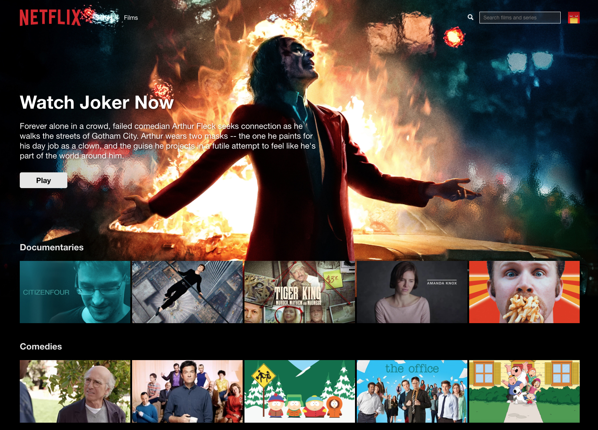

# Netflix clone using React custom hooks, context, Firebase and styled components

Netflix clone with functioning Sign up, Sign in, Log out using Firebase. 

The browse page has a functioning search using Fuse.js and a functioning portal player with a "default" non-copyright clip to demonstrate the use of the video player pop-up. 

Compound components were used to build the components with most of the CSS copied fron Netflix. Styling handled with styled-components npm.

  

